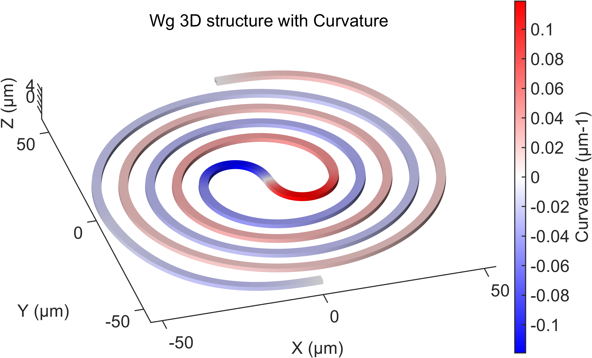
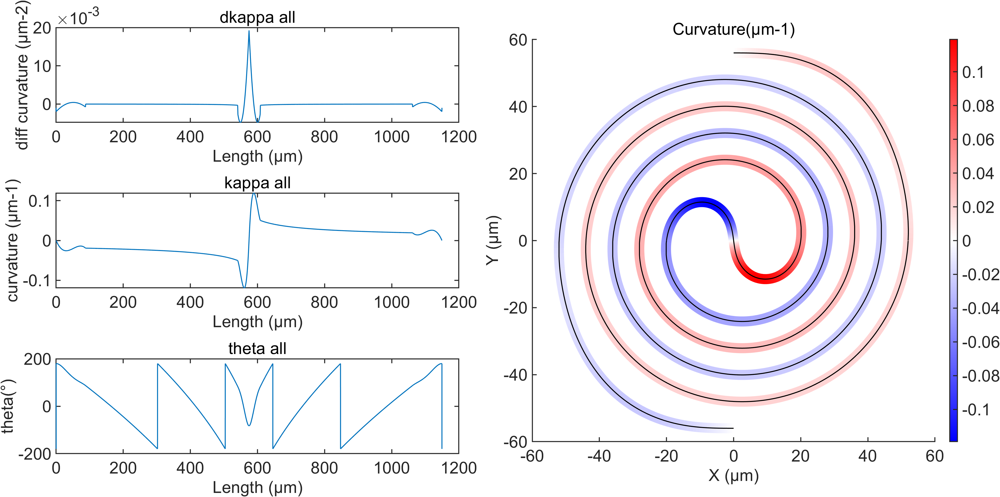

# matlab_photonic_gds_sim

<p align="right">
  <a href="#中文">中文</a> | <a href="#english">English</a>
</p>

---

## 中文

[Switch to English](#english)

### 项目概览

`matlab_photonic_gds_sim` 是一个面向集成光子版图生成、GDS 导出和电磁仿真前处理的 MATLAB 工具库。仓库核心是 `lib/` 下的几何类和导出函数，可以生成波导、电极、多边形、层级电路单元，并把这些结构转换为 GDS、Ansys HFSS 或 Lumerical FDTD 可使用的数据和脚本入口。

这个仓库适合以下工作流：

- 在 MATLAB 中参数化生成光子器件几何和版图。
- 导出 text GDS，并通过 KLayout 转换为 binary GDSII。
- 为 HFSS 准备二维/三维电极结构、工程参数、端口和 batch solve 入口。
- 为 Lumerical FDTD 准备 `addplanarsolid` 顶点、端口、仿真边界和 LSF 调用数据。
- 快速检查器件几何、曲率、宽度、端口和仿真区域，并导出可用于汇报或论文的图。

### 商业软件说明

本仓库仅包含作者自建的示例工程、MATLAB/Python/LSF 脚本和版图/仿真流程说明，不包含 Ansys、Lumerical、MATLAB、KLayout 等商业软件本体、授权文件或破解内容。使用者需要自行安装并合法授权相关软件。

### 可视化示例

库中的绘图函数不只是 debug 工具，也可以生成比较直观的三维几何图、二维版图预览、曲率分布图和仿真结构检查图。常用入口包括 `Wcli_wg.plot_3d`、`Wcli_wg.plot_3D_wg`、`Wcli_wg.plot_kappa_surf`、`Wcli_wg.plot_kappa_patch`、`Wcli_poly.plot_3d`、`Wcli_poly.plot_2d` 和 `Wcli_circuit.plot_circuit`。

`example_jpg/` 中保留了示例 GIF、视频和导出的 PNG。README 使用 PNG 预览，便于网页端直接查看。





### 目录结构

```text
.
|-- demo/
|   `-- demo_main.m
|-- example_jpg/
|   |-- 1.png
|   |-- 2.png
|   |-- 图片1.gif
|   `-- 媒体1.mp4
|-- examples/
|   |-- EO_cross_test_20260206/
|   |-- EO_slot_layout_sim/
|   |-- EO_trail_layout_sim/
|   |-- Euler_mod_bend_Si20260316/
|   `-- arbitrary_pose_bend_20260619/
|-- lib/
|   |-- Wcli_wg.m
|   |-- Wcli_poly.m
|   |-- Wcli_circuit.m
|   |-- Wcli_fig.m
|   |-- fdtd/
|   `-- hfss/
|-- output/
|-- .gitignore
|-- README.md
`-- matlab_photonic_gds_sim.code-workspace
```

### 核心能力

- 波导几何生成：直波导、圆弧、Euler bend、Euler-arc bend、对称/非对称 S-bend、cubic arbitrary-pose bend、taper、crossing、MMI、螺旋相关结构。
- 多边形和电极生成：slot 电极、T-rail 电极、GSG/GSGSG 相关金属、终端电阻、矩形 pad、自定义 polygon。
- 几何操作：平移、旋转、镜像、翻转、端口对齐、边界对齐、结构合并、闭环处理、按路径长度重采样。
- 版图组织：用 `Wcli_circuit` 把多个 `Wcli_wg` / `Wcli_poly` / 子电路组合成多层版图，支持扁平化和层级化 cell 管理。
- GDS 输出：支持单结构、多结构、flatten 或 hierarchy GDS 输出，并可调用 KLayout `strm2gds` 转成 binary GDSII。
- FDTD 数据转换和运行：把 MATLAB 几何顶点转换成 Lumerical FDTD `addplanarsolid` 顶点格式，可在 Windows GUI、Windows 后台或 Linux/Ubuntu 后台环境中启动 FDTD。
- HFSS 数据转换和运行：把二维 polygon 数据传给 HFSS Python 自动化脚本，支持可视化调试、后台 batch solve、结果提取和按参数目录归档。
- 参数扫描：通过结构体组合生成不同参数组合，并生成可读的保存名称，适合批量 GDS / HFSS / FDTD 扫描。

### 主要类

#### `Wcli_wg`

波导类，继承自 `Wcli_poly`。对象内部保存中心轨迹、顶/底边界、局部角度、宽度列表、曲率和路径长度等信息。

常用功能：

- `Straight_wg_gen` / `st_wg_gen`：生成直波导。
- `Arc_wg_gen` / `arc_wg_gen`：生成圆弧波导。
- `euler_wg_gen`、`euler_sym_wg_gen`、`euler_arc_bend_gen`、`euler_arc_sym_bend_gen`：生成 Euler 或 Euler-arc 弯曲。
- `Euler_Sbend_wg_gen`、`euler_s_wg_gen`、`cubic_pose_bend_gen`、`cubic_ratio_sbend_gen`：生成 S-bend 或任意姿态连接弯曲。
- `taper_waveguide_gen` / `taper_wg_gen`：生成宽度渐变波导。
- `cross_wg_gen`、`mmi_1x2_half_gen`：生成 crossing / MMI 相关结构。
- `merge_wg`、`align_wg`、`move_to`、`mirror_translate_shape`：组合和摆放结构。
- `plot_3d`、`plot_3D_wg`、`plot_kappa_surf`、`plot_kappa_patch`、`plot_trace`：绘制三维结构、曲率分布和中心轨迹。
- `to_poly`、`posdata2fdtd`、`postohfss2d`：转换到 polygon、FDTD 或 HFSS 格式。
- `generate_multi_gds`、`generate_multi_flatten_gds`：输出多结构 GDS。

#### `Wcli_poly`

通用多边形类，用于表示带刻蚀角和厚度的 top/bottom polygon。它也是电极、pad 和 FDTD/HFSS polygon 数据转换的基础类。

常用功能：

- 管理 `XY` 和 `XY_top`。
- 根据 `etch_angle` 和 `thickness` 计算 top/bottom 宽度差。
- 管理端口 `port_edges` 和 `port_list`。
- 生成 slot/T-rail/rect 等常见多边形。
- 绘制二维/三维 polygon，并显示端口和边界。
- 进行几何变换、合并、GDS 输出。
- `posdata2fdtd`：生成 Lumerical FDTD 可读的顶点格式。
- `postohfss2d`：生成 HFSS Python 入口可读的二维 polygon 数据。
- `run_fdtd_sim`：从 MATLAB 调用 Lumerical FDTD 脚本流。

#### `Wcli_circuit`

多单元电路容器。它可以保存多个 `Wcli_poly`、`Wcli_wg` 和嵌套 `Wcli_circuit`，并为每个 cell 分配 layer 和相对位置。

常用功能：

- 多 cell 组合和子电路嵌套。
- layer 管理和相对位置管理。
- flatten 成 polygon 列表。
- 生成 flatten 或 hierarchy GDS。
- 整体平移、旋转、镜像、边界查询和绘图。

#### `Wcli_fig`

轻量级 MATLAB 图形辅助类，用于统一字体、线宽和保存 figure。

### 快速开始

在 MATLAB 中打开仓库根目录，然后运行：

```matlab
run('demo/demo_main.m')
```

这个 demo 会做以下事情：

- 自动定位仓库根目录和 `lib/`。
- 将 `lib/` 加入 MATLAB path。
- 生成直波导、圆弧、taper、slot 电极、T-rail 电极和矩形 polygon。
- 演示对齐、合并和 `Wcli_circuit` 打包。
- 在 `output/demo_output/` 下导出 `demo_layout.gds`。
- 如果找到 KLayout `strm2gds`，继续导出 binary GDSII。

单独运行 example 脚本时，建议先执行：

```matlab
repoRoot = pwd;
addpath(fullfile(repoRoot, 'lib'));
```

更稳妥的方式是在脚本里根据脚本位置自动查找 `lib/`，避免依赖 MATLAB 当前工作目录。

### 示例目录

#### `demo/demo_main.m`

最小端到端 smoke test，覆盖核心对象生成、绘图、组合、GDS 输出和参数扫描命名。修改 `lib/` 后建议先跑这个 demo。

#### `examples/EO_slot_layout_sim/`

slot 电极版图和 HFSS 仿真相关脚本。该目录自带项目需要的 HFSS 入口脚本、基础 AEDT 工程、`hfss_utils.py` 和 `Export_data.py`，避免不同工程共用同一个 AEDT 模板造成变量、端口、材料或 setup 不匹配。

主要文件：

- `EO_slot_gds_fold_AM_gen_20260206.m`
- `EO_fold_slot_gen_wcli_20251230.m`
- `EO_str_slot_gen_wcli_20251126.m`
- `Slot_fold.py`
- `Slot_str.py`
- `Slot_TWE_GSG_base.aedt`
- `hfss_utils.py`
- `Export_data.py`

#### `examples/EO_trail_layout_sim/`

T-rail 电极版图和 HFSS 仿真相关脚本。该目录同样自带项目级 HFSS 资源。

主要文件：

- `EO_Trail_gds_fold_AM_gen_20260206.m`
- `EO_gen_wcli_20251031.m`
- `EO_str_gen_wcli_20251126.m`
- `T_rail_bend.py`
- `T_rail_str.py`
- `T_rail_TWE_GSG_base.aedt`
- `hfss_utils.py`
- `Export_data.py`

#### `examples/EO_cross_test_20260206/`

crossing test 版图脚本。GDS 文件由脚本在本地生成，默认不进入 Git。

#### `examples/Euler_mod_bend_Si20260316/`

Euler bend + FDTD 仿真示例。主要脚本会生成 Euler-arc 对称弯曲，设置 FDTD 端口、仿真边界和材料结构，并调用 `Wcli_wg.run_fdtd_sim`。

主要文件：

- `Euler_mod_bend_gen.m`
- `FDTD_lsf.lsf`
- `my_fdtd_function.lsf`
- `bend_sim_basic.fsp`
- `bend_sim_basic_backup.fsp`

#### `examples/arbitrary_pose_bend_20260619/`

任意姿态弯曲和 cubic S-bend 示例，包含 MATLAB demo、生成图和曲率图，适合检查任意姿态连接算法和曲率连续性。

### FDTD 工作流

FDTD 入口在 `Wcli_poly.run_fdtd_sim`。由于 `Wcli_wg` 继承自 `Wcli_poly`，所以也可以通过 `Wcli_wg.run_fdtd_sim(...)` 调用。

`fdtd_data` 必需字段：

- `sim_file_name`：基础 FDTD project 文件名，例如 `bend_sim_basic.fsp`。
- `para_name`：当前参数组合的保存名称。
- `device_name`：器件名前缀，用于生成输出目录。

`fdtd_data` 常用可选字段：

- `sim_file_path`：优先搜索基础 `.fsp` 和 `.lsf` 的目录。
- `run_date`：运行日期字符串；不填时使用 `datestr(now,'yyyymmdd')`。
- `output_root`：结果保存根目录；不填时使用 MATLAB 当前 `pwd`。
- `fdtd_pos_list`：FDTD polygon 顶点 cell list，一般由 `posdata2fdtd` 得到后乘以 `nm`。
- `port_xy_list`：端口坐标，通常用 MATLAB 几何坐标乘以 `um`。
- `port_xy_dir`：端口方向字符串，例如 `['X','X']`。
- `sim_edge_xy`：FDTD 仿真区域边界，通常用 MATLAB 几何坐标乘以 `um`。
- `para`：参数结构体，会保存到 `matlab2fdtd_data.mat`，LSF 中也会读取。
- `h_slab`：slab 高度等 FDTD 所需物理参数。

`run_fdtd_sim` 支持以下 name-value 参数：

- `gui_flag`：`1` 表示显示 FDTD GUI，`0` 表示后台/无界面运行。
- `lsf_script`：要执行的 LSF 脚本，默认 `FDTD_lsf.lsf`。
- `fdtd_exe`：手动指定 FDTD 可执行文件路径；为空时按操作系统选择默认路径。
- `flag_run`：传给 LSF 的运行标志。`1` 时 LSF 中执行 `run`；`0` 时 LSF 仍会启动 FDTD、加载脚本、生成/保存 `.fsp`，但跳过真正仿真计算。

文件搜索顺序：

1. `fdtd_data.sim_file_path`，如果提供。
2. MATLAB 当前工作目录 `pwd`。
3. 仓库库目录下的 `lib/fdtd/`。

典型调试调用：

```matlab
Wcli_wg.run_fdtd_sim(fdtd_data, ...
    "flag_run", 0, ...
    "gui_flag", 1, ...
    "lsf_script", "FDTD_lsf.lsf");
```

典型后台运行调用：

```matlab
Wcli_wg.run_fdtd_sim(fdtd_data, ...
    "flag_run", 1, ...
    "gui_flag", 0, ...
    "lsf_script", "FDTD_lsf.lsf");
```

Linux / Ubuntu 运行说明：

- 代码中已经包含 `isunix && ~ismac` 分支，可在 Ubuntu MATLAB 环境下运行 FDTD。
- 如果默认 FDTD 路径与实际安装路径不一致，应通过 `fdtd_exe` 显式指定。
- 无界面批量跑时推荐使用 `gui_flag=0`。
- 如果只想生成 `.fsp` 检查几何和端口，使用 `flag_run=0`。
- 如果要真正计算并导出结果，使用 `flag_run=1`。

### HFSS 工作流

HFSS 资源按 example 就近放置。每个需要拉起 HFSS 的工程目录应自带自己的 Python 入口、基础 AEDT 工程、`hfss_utils.py` 和 `Export_data.py`。这样做是为了避免不同器件共用同一个 AEDT 模板导致变量、端口编号、材料、边界或 setup 不匹配。

MATLAB 侧通常先构造 `json_struct`，其中包含保存目录、脚本目录、HFSS Python 入口、结构坐标、频率范围等信息，然后调用：

```matlab
Wcli_wg.put_HFSS(json_struct, ...
    'run_flag', 1, ...
    'gui_flag', 0, ...
    'machine_select', machine_select);
```

推荐设置方式：

```matlab
scriptFolder = fileparts(mfilename('fullpath'));
json_struct.scriptFolder = scriptFolder;
json_struct.open_py = 'project_entry.py';
json_struct.extract_py = 'Export_data.py';
```

运行模式：

- `run_flag=0`：用于可视化调试，启动 HFSS 并生成/打开临时工程。
- `run_flag=1`：把 `sim_result.aedt`、`parameters.txt` 和 `para_save.mat` 复制到 `json_struct.save_folder`，再在保存目录下执行 batch solve 和数据提取。
- `gui_flag=1`：可视化运行，适合检查 HFSS 工程是否正确打开、端口/边界/setup 是否正常。
- `gui_flag=0`：后台运行，适合批量扫描。

注意事项：

- `HFSS_save_folder` 对应的是 batch solve 使用的工程工作目录，不只是仿真结束后的结果目录。
- 如果同一参数目录曾经异常中断，可能残留 `.lock`、`.q` 或 `.batchinfo` 文件，HFSS 会认为工程仍被占用或排队。重新运行前应清理这些残留文件。
- `sim_result.aedtresults/` 是 HFSS 结果目录；如果需要完全重算，可以在确认不需要旧结果后删除。

### GDS 输出

MATLAB 侧通常先导出 text GDS，再用 KLayout 转换为 binary GDSII。

典型用法：

```matlab
demo_circuit.generate_gds(demoGdsPath, 'DEMO_TOP', 'DEMO_LIB');
Wcli_poly.klayout_gds2gdsii(demoGdsPath, demoGdsiiPath, klayoutExe);
```

也可以使用 `Wcli_wg.generate_multi_flatten_gds(...)` 或 `Wcli_poly.generate_multi_flatten_gds(...)` 直接输出多结构 flatten GDS。

注意事项：

- 输出目录不存在时，有些函数会自动创建，有些脚本需要先创建目录。
- layer 编号由调用脚本传入，应与工艺层定义一致。
- binary GDSII 转换依赖 KLayout 的 `strm2gds`。
- 大规模参数扫描时，建议每组参数使用 `generate_save_name` 生成唯一文件名。

### 依赖

最低要求：

- MATLAB，支持 `classdef`、`arguments` block、handle class。
- 仓库 `lib/` 在 MATLAB path 中。

可选依赖：

- KLayout：用于 GDSII 转换。
- Ansys Electronics Desktop / HFSS：用于 HFSS 自动化。
- Python：用于 HFSS 脚本。
- Lumerical FDTD：用于 `.fsp` / `.lsf` 仿真流。
- Linux Ubuntu：可作为 FDTD 批量仿真环境。

### Git 和输出文件约定

`.gitignore` 会忽略常见本地输出：

- `output/`
- `tempfig/`
- Python cache
- 日志文件
- `para_save.mat`
- `matlab2fdtd_data.mat`
- `matlab_to_hfss.json`
- `parameters.txt`
- `sim_result.aedt`
- HFSS `.aedtresults/`
- `*.gds`
- `examples/**/share/`

说明：

- `output/` 用于本地 demo 或临时生成结果，不进入 Git。
- `examples/**/share/` 是本地打包给他人的临时 share 工作区，不进入 Git，也不随远端同步。
- example 目录下生成的 GDS 文件默认作为本地输出处理，不提交到公开仓库。
- HFSS/FDTD 临时结果和大型中间结果不应提交，除非它们是明确需要保留的参考产物。
- PNG、GIF、视频可以作为公开文档和复现实例保留；含本机路径或私有工程信息的二进制工程/figure 文件不建议提交。

### 维护建议

- 修改 `lib/` 后先运行 `demo/demo_main.m`。
- 修改 FDTD 相关逻辑后先用 `flag_run=0` 生成 `.fsp`，再打开 FDTD GUI 检查几何、材料、端口和仿真区域。
- 修改 HFSS example 时，确保 Python 入口、基础 AEDT、`hfss_utils.py` 和 `Export_data.py` 与 MATLAB 主脚本放在同一目录。
- 修改 GDS 输出逻辑后用 KLayout 打开结果，检查层号、cell 名称、polygon 闭合和单位。
- 新增 example 时，尽量包含脚本位置自发现逻辑，减少对 MATLAB 当前目录的依赖。
- 大文件仿真结果不要直接提交到 Git，除非它们是明确需要保留的参考产物。

---

## English

[切换到中文](#中文)

### Overview

`matlab_photonic_gds_sim` is a MATLAB toolkit for integrated-photonics layout generation, GDS export, and electromagnetic-simulation preparation. The core code in `lib/` provides geometry classes and export helpers for waveguides, electrodes, polygons, and hierarchical circuit cells. These objects can be converted into GDS layouts, Ansys HFSS automation inputs, or Lumerical FDTD data.

The repository is designed for these workflows:

- Parameterized photonic-device geometry and layout generation in MATLAB.
- Text GDS export and optional conversion to binary GDSII through KLayout.
- HFSS preparation with geometry, project parameters, ports, and batch-solve entry points.
- Lumerical FDTD preparation with `addplanarsolid` vertices, ports, simulation boundaries, and LSF launch data.
- Visual inspection of geometry, curvature, width, ports, and simulation regions, with figures suitable for reports or papers.

### Commercial Software Notice

This repository contains only user-created example projects, MATLAB/Python/LSF scripts, and layout/simulation workflow documentation. It does not include Ansys, Lumerical, MATLAB, KLayout, commercial software binaries, license files, or license circumvention material. Users must install and legally license the required tools separately.

### Visualization Examples

The plotting functions are useful for both debugging and presentation-quality inspection. They can render intuitive 3D geometry views, 2D layout previews, curvature maps, and simulation-preparation structures. Common entry points include `Wcli_wg.plot_3d`, `Wcli_wg.plot_3D_wg`, `Wcli_wg.plot_kappa_surf`, `Wcli_wg.plot_kappa_patch`, `Wcli_poly.plot_3d`, `Wcli_poly.plot_2d`, and `Wcli_circuit.plot_circuit`.

The `example_jpg/` folder keeps GIF/video assets and exported PNG previews. The README references PNG files so they can be previewed directly on GitHub.


### Repository Layout

```text
.
|-- demo/
|   `-- demo_main.m
|-- example_jpg/
|   |-- 1.png
|   |-- 2.png
|   |-- 图片1.gif
|   `-- 媒体1.mp4
|-- examples/
|   |-- EO_cross_test_20260206/
|   |-- EO_slot_layout_sim/
|   |-- EO_trail_layout_sim/
|   |-- Euler_mod_bend_Si20260316/
|   `-- arbitrary_pose_bend_20260619/
|-- lib/
|   |-- Wcli_wg.m
|   |-- Wcli_poly.m
|   |-- Wcli_circuit.m
|   |-- Wcli_fig.m
|   |-- fdtd/
|   `-- hfss/
|-- output/
|-- .gitignore
|-- README.md
`-- matlab_photonic_gds_sim.code-workspace
```

### Core Capabilities

- Waveguide generation: straight waveguides, arcs, Euler bends, Euler-arc bends, symmetric/asymmetric S-bends, cubic arbitrary-pose bends, tapers, crossings, MMI structures, and spiral-like structures.
- Polygon/electrode generation: slot electrodes, T-rail electrodes, GSG/GSGSG-related metals, termination resistors, rectangular pads, and custom polygons.
- Geometry operations: translation, rotation, mirroring, flipping, port alignment, boundary alignment, merging, ring closing, and length-based resampling.
- Layout composition: `Wcli_circuit` groups multiple `Wcli_wg`, `Wcli_poly`, and nested circuits into layered layouts with flattened or hierarchical cell management.
- GDS export: single-structure, multi-structure, flattened, and hierarchical GDS generation, with optional KLayout `strm2gds` conversion to binary GDSII.
- FDTD conversion and execution: MATLAB geometry can be converted to Lumerical FDTD `addplanarsolid` vertex data and launched in Windows GUI, Windows background, or Linux/Ubuntu headless modes.
- HFSS conversion and execution: 2D polygon data can be passed to HFSS Python automation scripts for visual debugging, background batch solve, result extraction, and parameter-folder archiving.
- Parameter sweeps: parameter structs can be expanded into combinations with readable save names for batch GDS / HFSS / FDTD sweeps.

### Main Classes

#### `Wcli_wg`

Waveguide class derived from `Wcli_poly`. It stores the center trace, top/bottom edges, local angle list, width list, curvature data, and trace length.

Common methods:

- `Straight_wg_gen` / `st_wg_gen`: straight waveguide generation.
- `Arc_wg_gen` / `arc_wg_gen`: arc waveguide generation.
- `euler_wg_gen`, `euler_sym_wg_gen`, `euler_arc_bend_gen`, `euler_arc_sym_bend_gen`: Euler and Euler-arc bend generation.
- `Euler_Sbend_wg_gen`, `euler_s_wg_gen`, `cubic_pose_bend_gen`, `cubic_ratio_sbend_gen`: S-bend and arbitrary-pose bend generation.
- `taper_waveguide_gen` / `taper_wg_gen`: taper generation.
- `cross_wg_gen`, `mmi_1x2_half_gen`: crossing and MMI-related geometry.
- `merge_wg`, `align_wg`, `move_to`, `mirror_translate_shape`: placement and composition helpers.
- `plot_3d`, `plot_3D_wg`, `plot_kappa_surf`, `plot_kappa_patch`, `plot_trace`: 3D geometry, curvature, and trace plotting.
- `to_poly`, `posdata2fdtd`, `postohfss2d`: conversion to polygon, FDTD, or HFSS data.
- `generate_multi_gds`, `generate_multi_flatten_gds`: multi-structure GDS export.

#### `Wcli_poly`

General polygon class for top/bottom geometry with etch angle and thickness. It is the base class for many electrode, pad, FDTD, and HFSS polygon workflows.

Common methods:

- Manage `XY` and `XY_top`.
- Compute top/bottom width offsets from `etch_angle` and `thickness`.
- Manage `port_edges` and `port_list`.
- Generate slot, T-rail, rectangle, and custom polygon geometry.
- Plot 2D/3D polygons with ports and boundaries.
- Apply transforms, merge geometry, and export GDS.
- `posdata2fdtd`: generate vertex data for Lumerical FDTD.
- `postohfss2d`: generate 2D polygon data for HFSS Python automation.
- `run_fdtd_sim`: launch the Lumerical FDTD script flow from MATLAB.

#### `Wcli_circuit`

Circuit-level container for multiple `Wcli_poly`, `Wcli_wg`, and nested `Wcli_circuit` objects. It manages layer assignment and relative placement for each cell.

Common methods:

- Multi-cell composition and nested subcircuits.
- Layer and relative-position management.
- Flattening into polygon lists.
- Flattened or hierarchical GDS export.
- Global translation, rotation, mirroring, boundary queries, and plotting.

#### `Wcli_fig`

Small MATLAB figure helper for consistent fonts, line widths, and figure saving.

### Quick Start

Open the repository root in MATLAB and run:

```matlab
run('demo/demo_main.m')
```

The demo:

- Finds the workspace root and `lib/`.
- Adds `lib/` to the MATLAB path.
- Generates straight waveguides, arcs, tapers, slot electrodes, T-rail electrodes, and rectangular polygons.
- Demonstrates alignment, merging, and `Wcli_circuit` packaging.
- Exports `demo_layout.gds` under `output/demo_output/`.
- Converts the text GDS to binary GDSII if KLayout `strm2gds` is found.

For standalone scripts, add the library path first:

```matlab
repoRoot = pwd;
addpath(fullfile(repoRoot, 'lib'));
```

For robust scripts, prefer discovering `lib/` from the script location rather than relying on MATLAB's current working directory.

### Example Directories

#### `demo/demo_main.m`

Minimal end-to-end smoke test for core object generation, plotting, composition, GDS export, and parameter-sweep naming. Run this first after editing `lib/`.

#### `examples/EO_slot_layout_sim/`

Slot-electrode layout and HFSS simulation scripts. This folder carries project-local HFSS entry scripts, a base AEDT project, `hfss_utils.py`, and `Export_data.py`, so different projects do not accidentally share incompatible variables, ports, materials, or setup definitions.

Important files:

- `EO_slot_gds_fold_AM_gen_20260206.m`
- `EO_fold_slot_gen_wcli_20251230.m`
- `EO_str_slot_gen_wcli_20251126.m`
- `Slot_fold.py`
- `Slot_str.py`
- `Slot_TWE_GSG_base.aedt`
- `hfss_utils.py`
- `Export_data.py`

#### `examples/EO_trail_layout_sim/`

T-rail electrode layout and HFSS simulation scripts. This folder also carries project-local HFSS resources.

Important files:

- `EO_Trail_gds_fold_AM_gen_20260206.m`
- `EO_gen_wcli_20251031.m`
- `EO_str_gen_wcli_20251126.m`
- `T_rail_bend.py`
- `T_rail_str.py`
- `T_rail_TWE_GSG_base.aedt`
- `hfss_utils.py`
- `Export_data.py`

#### `examples/EO_cross_test_20260206/`

Crossing-test layout script. GDS files are generated locally by the script and are ignored by default.

#### `examples/Euler_mod_bend_Si20260316/`

Euler bend plus FDTD simulation example. The main script builds an Euler-arc symmetric bend, prepares FDTD ports and simulation boundaries, and calls `Wcli_wg.run_fdtd_sim`.

Important files:

- `Euler_mod_bend_gen.m`
- `FDTD_lsf.lsf`
- `my_fdtd_function.lsf`
- `bend_sim_basic.fsp`
- `bend_sim_basic_backup.fsp`

#### `examples/arbitrary_pose_bend_20260619/`

Arbitrary-pose bend and cubic S-bend examples, including MATLAB demos, rendered geometry figures, and curvature figures.

### FDTD Workflow

The FDTD entry point is `Wcli_poly.run_fdtd_sim`. Since `Wcli_wg` derives from `Wcli_poly`, it is commonly called as `Wcli_wg.run_fdtd_sim(...)`.

Required `fdtd_data` fields:

- `sim_file_name`: base FDTD project, for example `bend_sim_basic.fsp`.
- `para_name`: save name for the current parameter set.
- `device_name`: device prefix for output-folder naming.

Common optional `fdtd_data` fields:

- `sim_file_path`: preferred folder for the base `.fsp` and `.lsf` files.
- `run_date`: date string; defaults to `datestr(now,'yyyymmdd')`.
- `output_root`: output root; defaults to MATLAB `pwd`.
- `fdtd_pos_list`: cell list of FDTD polygon vertices, usually from `posdata2fdtd` and scaled by `nm`.
- `port_xy_list`: port coordinates, usually MATLAB layout coordinates scaled by `um`.
- `port_xy_dir`: port normal directions, for example `['X','X']`.
- `sim_edge_xy`: FDTD simulation boundary, usually layout coordinates scaled by `um`.
- `para`: parameter struct saved into `matlab2fdtd_data.mat` and loaded by LSF.
- `h_slab`: slab height or other physical parameters required by the LSF script.

Supported name-value options:

- `gui_flag`: `1` opens the FDTD GUI; `0` runs in hidden/background mode.
- `lsf_script`: LSF script name; defaults to `FDTD_lsf.lsf`.
- `fdtd_exe`: explicit FDTD executable path. If empty, the function chooses an OS-specific default.
- `flag_run`: runtime flag passed to LSF. `1` runs the simulation; `0` still launches FDTD and saves the prepared `.fsp`, but skips the actual `run` command inside LSF.

File search order:

1. `fdtd_data.sim_file_path`, if provided.
2. MATLAB `pwd`.
3. `lib/fdtd/`.

Typical debug run:

```matlab
Wcli_wg.run_fdtd_sim(fdtd_data, ...
    "flag_run", 0, ...
    "gui_flag", 1, ...
    "lsf_script", "FDTD_lsf.lsf");
```

Typical background run:

```matlab
Wcli_wg.run_fdtd_sim(fdtd_data, ...
    "flag_run", 1, ...
    "gui_flag", 0, ...
    "lsf_script", "FDTD_lsf.lsf");
```

Linux / Ubuntu notes:

- The code includes an `isunix && ~ismac` branch and can run FDTD from MATLAB on Ubuntu.
- If the default FDTD path does not match the installation, pass `fdtd_exe` explicitly.
- Use `gui_flag=0` for headless batch runs.
- Use `flag_run=0` to generate and inspect `.fsp` without running the solver.
- Use `flag_run=1` to run the solver and export results.

### HFSS Workflow

HFSS resources are stored next to each example that needs them. Each HFSS example should carry its own Python entry point, base AEDT project, `hfss_utils.py`, and `Export_data.py`. This avoids mismatches in variables, port numbering, materials, boundaries, or setup definitions across projects.

MATLAB usually prepares `json_struct` with save folders, script folders, HFSS Python entry names, geometry coordinates, frequency settings, and related parameters, then calls:

```matlab
Wcli_wg.put_HFSS(json_struct, ...
    'run_flag', 1, ...
    'gui_flag', 0, ...
    'machine_select', machine_select);
```

Recommended project-local setup:

```matlab
scriptFolder = fileparts(mfilename('fullpath'));
json_struct.scriptFolder = scriptFolder;
json_struct.open_py = 'project_entry.py';
json_struct.extract_py = 'Export_data.py';
```

Run modes:

- `run_flag=0`: visual/debug mode; starts HFSS and generates or opens a temporary project.
- `run_flag=1`: copies `sim_result.aedt`, `parameters.txt`, and `para_save.mat` into `json_struct.save_folder`, then runs batch solve and data extraction from that saved copy.
- `gui_flag=1`: visual mode for checking whether the project, ports, boundaries, and setup open correctly.
- `gui_flag=0`: background mode for parameter sweeps.

Notes:

- `HFSS_save_folder` is the project working directory used by batch solve, not only a final result folder.
- If a previous run in the same parameter folder was interrupted, stale `.lock`, `.q`, or `.batchinfo` files may make HFSS think the project is still open or queued. Clean these files before re-running.
- `sim_result.aedtresults/` stores HFSS results; remove it only when a clean rerun is intended and old results are no longer needed.

### GDS Export

The usual workflow is to export text GDS from MATLAB and then convert it to binary GDSII with KLayout.

Typical usage:

```matlab
demo_circuit.generate_gds(demoGdsPath, 'DEMO_TOP', 'DEMO_LIB');
Wcli_poly.klayout_gds2gdsii(demoGdsPath, demoGdsiiPath, klayoutExe);
```

You can also use `Wcli_wg.generate_multi_flatten_gds(...)` or `Wcli_poly.generate_multi_flatten_gds(...)` for flattened multi-structure GDS output.

Notes:

- Some functions create output folders automatically; some scripts expect the folder to exist.
- Layer numbers are script-defined and should match the intended process layer map.
- Binary GDSII conversion requires KLayout `strm2gds`.
- For large sweeps, use `generate_save_name` to create unique, readable filenames.

### Dependencies

Minimum requirements:

- MATLAB with `classdef`, `arguments` blocks, and handle-class support.
- The repository `lib/` folder on the MATLAB path.

Optional dependencies:

- KLayout for GDSII conversion.
- Ansys Electronics Desktop / HFSS for HFSS automation.
- Python for HFSS scripts.
- Lumerical FDTD for `.fsp` / `.lsf` simulation workflows.
- Linux Ubuntu as an optional FDTD batch-simulation environment.

### Git and Output Conventions

`.gitignore` excludes common local outputs:

- `output/`
- `tempfig/`
- Python cache
- log files
- `para_save.mat`
- `matlab2fdtd_data.mat`
- `matlab_to_hfss.json`
- `parameters.txt`
- `sim_result.aedt`
- HFSS `.aedtresults/`
- `*.gds`
- `examples/**/share/`

Notes:

- `output/` is for local demo or temporary generated files and is not tracked.
- `examples/**/share/` is a local temporary share workspace and is neither tracked nor synchronized to the remote repository.
- Generated GDS files under example folders are treated as local outputs and are not committed to the public repository by default.
- HFSS/FDTD temporary results and large intermediate outputs should not be committed unless they are intentionally preserved reference artifacts.
- PNG, GIF, and video files may be tracked when they are useful as public documentation and reproduction artifacts; binary project/figure files that may contain local paths or private project metadata should not be committed.

### Maintenance Notes

- After editing `lib/`, run `demo/demo_main.m` first.
- After editing FDTD logic, first use `flag_run=0` to generate `.fsp`, then inspect geometry, material, ports, and simulation boundaries in the FDTD GUI.
- After editing an HFSS example, keep the Python entry point, base AEDT project, `hfss_utils.py`, and `Export_data.py` in the same folder as the MATLAB main script.
- After editing GDS export logic, inspect the result in KLayout for layers, cell names, closed polygons, and units.
- New examples should include script-location-based path discovery to reduce dependence on MATLAB's current working directory.
- Do not commit large simulation results unless they are intentionally preserved reference artifacts.
